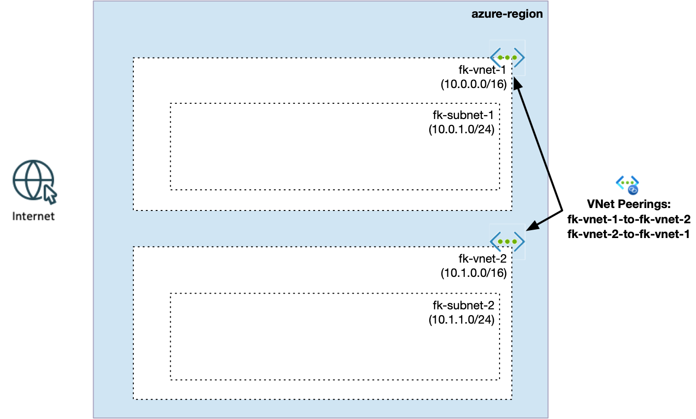
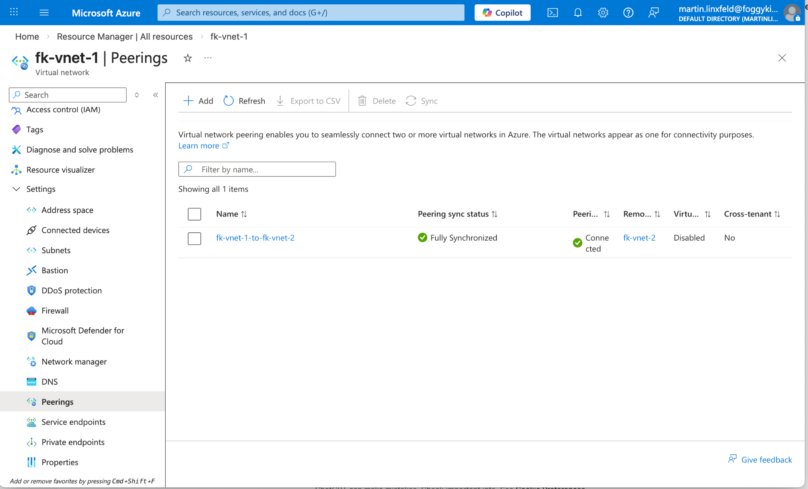

# Example 01: Azure VNet Peering (Basic)

In this example, we deploy **two Azure Virtual Networks (VNets)** and connect them using **VNet Peering** with Terraform/OpenTofu.

This is the first step toward building **hub-and-spoke architectures**, private connectivity patterns, and multi-VNet designs in Azure.

---

## 🧭 Architecture Overview



This deployment creates:

- A Resource Group
- Two Virtual Networks:
  - fk-vnet-1 (10.0.0.0/16)
  - fk-vnet-2 (10.1.0.0/16)
- One subnet in each VNet
- Bidirectional VNet peering between both networks

Once peered, both VNets can communicate privately using internal IP addresses.

---

## 🚀 Deployment Steps

Initialize and apply the configuration:

```bash
tofu init
tofu plan
tofu apply
```

After deployment, Terraform will output:

- VNet IDs
- Peering IDs

---

## 🖼️ Azure Portal Verification



After deployment, verify the following in Azure Portal:

### VNet 1 Subnet
- fk-subnet1 (10.0.1.0/24)

### VNet 2 Subnet
- fk-subnet2 (10.1.1.0/24)

### VNet Peering (both directions)
- fk-vnet-1 → fk-vnet-2 (Connected)
- fk-vnet-2 → fk-vnet-1 (Connected)

### Peering Settings
- Allow virtual network access ✅
- Allow forwarded traffic ✅

This confirms that both VNets are fully connected.

---

## 🧠 Design Notes

- VNet Peering is **non-transitive**
- Traffic stays on Microsoft backbone (no internet)
- CIDR ranges must not overlap
- Peering is always **bidirectional**

This is a foundational building block for:

- Hub-and-spoke architectures
- Private Endpoint designs across VNets
- Centralized DNS and shared services

---

## 🧹 Cleanup

To remove all resources:

```bash
tofu destroy
```

---

## ✅ Summary

This example demonstrates:

- How to create and peer two Azure VNets
- How private connectivity works between networks
- The foundation for advanced Azure architectures

---

## 🌐 Learn More

This example is part of the FoggyKitchen training ecosystem.

Continue your journey:

👉 https://foggykitchen.com/courses/azure-fundamentals-terraform-course/

---

## 🪪 License

Licensed under the Universal Permissive License (UPL), Version 1.0.
