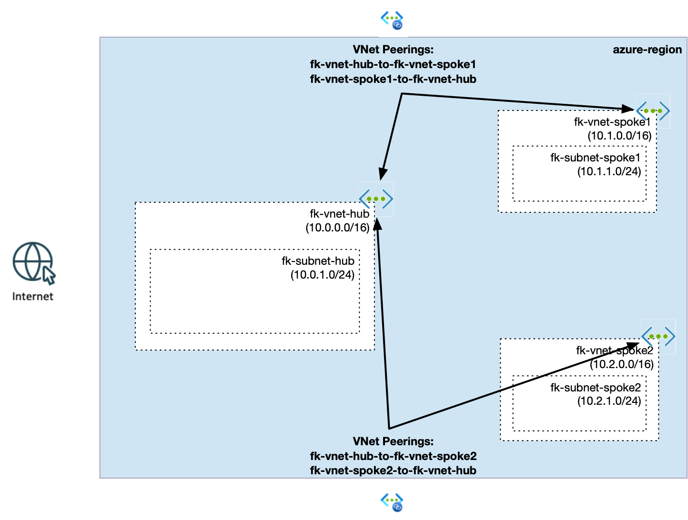
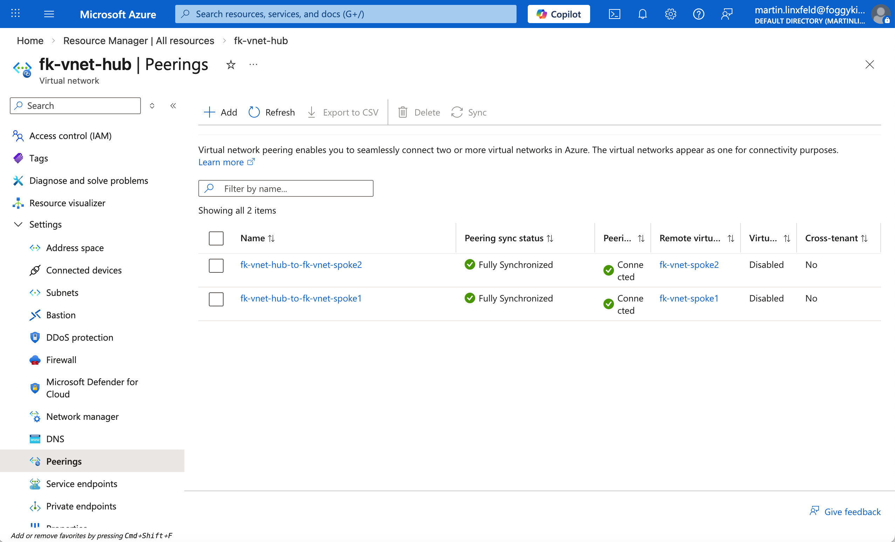

# Example 02: Azure VNet Peering (Hub-and-Spoke)

In this example, we deploy a **Hub-and-Spoke network topology** in Azure with Terraform/OpenTofu.

The deployment includes one central **Hub VNet** and two **Spoke VNets**, connected through dedicated VNet peerings.

---

## 🧭 Architecture Overview



This deployment creates:

- A Resource Group
- Three Virtual Networks:
  - fk-vnet-hub (10.0.0.0/16)
  - fk-vnet-spoke1 (10.1.0.0/16)
  - fk-vnet-spoke2 (10.2.0.0/16)
- One subnet in each VNet:
  - fk-hub-subnet (10.0.1.0/24)
  - fk-subnet-spoke1 (10.1.1.0/24)
  - fk-subnet-spoke2 (10.2.1.0/24)
- Bidirectional VNet peering:
  - Hub ↔ Spoke1
  - Hub ↔ Spoke2

This model is commonly used to centralize shared services (DNS, firewall, routing, private endpoints) in the Hub.

---

## 🚀 Deployment Steps

Initialize and apply the configuration:

```bash
tofu init
tofu plan
tofu apply
```

After deployment, Terraform will output resource and peering IDs.

---

## 🖼️ Azure Portal Verification



After deployment, verify the following in Azure Portal:

### Hub VNet
- fk-vnet-hub (10.0.0.0/16)
- fk-hub-subnet (10.0.1.0/24)

### Spoke VNets
- fk-vnet-spoke1 (10.1.0.0/16)
- fk-subnet-spoke1 (10.1.1.0/24)
- fk-vnet-spoke2 (10.2.0.0/16)
- fk-subnet-spoke2 (10.2.1.0/24)

### VNet Peering
- fk-vnet-hub → fk-vnet-spoke1 (Connected)
- fk-vnet-spoke1 → fk-vnet-hub (Connected)
- fk-vnet-hub → fk-vnet-spoke2 (Connected)
- fk-vnet-spoke2 → fk-vnet-hub (Connected)

### Peering Settings
- Allow virtual network access ✅
- Allow forwarded traffic ✅

---

## 🧠 Design Notes

- Spoke-to-spoke connectivity is **not direct** in this layout unless additional peering or transit routing is configured
- VNet Peering is **non-transitive**
- Traffic stays on Microsoft backbone (no internet)
- CIDR ranges must not overlap
- Hub-and-spoke helps centralize shared network services and governance

---

## 🧹 Cleanup

To remove all resources:

```bash
tofu destroy
```

---

## ✅ Summary

This example demonstrates:

- How to build a Hub-and-Spoke VNet topology in Azure
- How to connect multiple spokes to a central hub using VNet peering
- A practical foundation for scalable enterprise network design

---

## 🌐 Learn More

This example is part of the FoggyKitchen training ecosystem.

Continue your journey:

👉 https://foggykitchen.com/courses/azure-fundamentals-terraform-course/

---

## 🪪 License

Licensed under the Universal Permissive License (UPL), Version 1.0.
