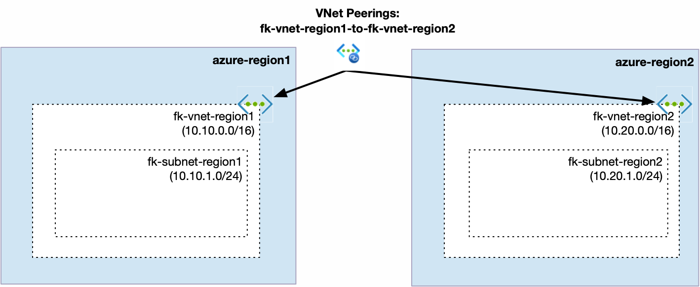
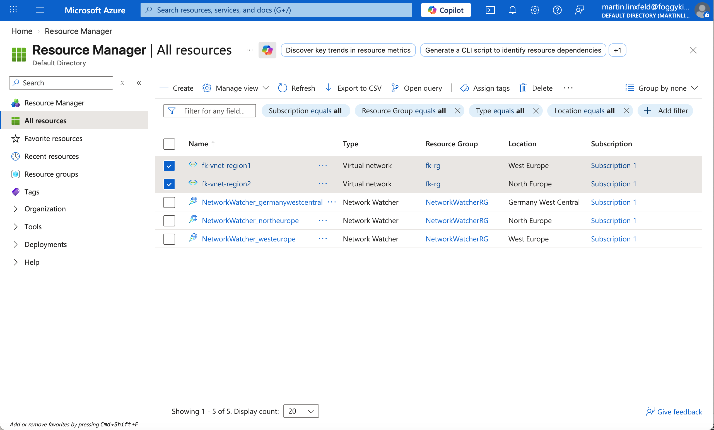
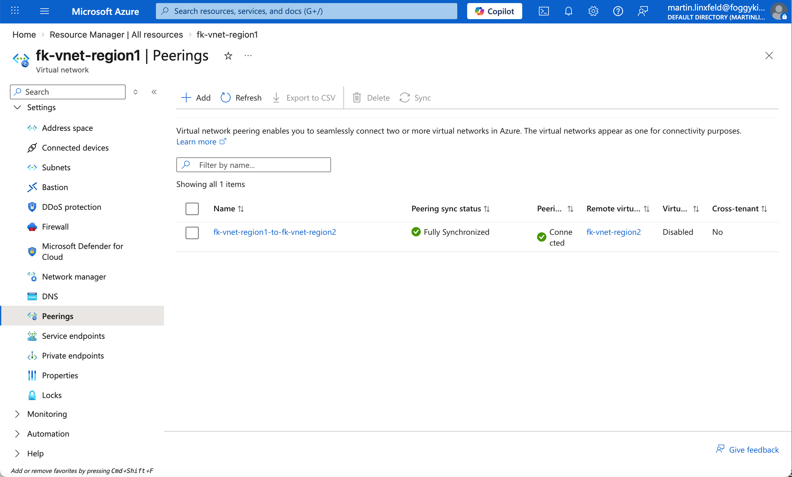

# Example 03: Azure VNet Peering (Cross-Region)

In this example, we deploy **two Azure Virtual Networks (VNets)** in **different Azure regions** and connect them using **VNet Peering** with Terraform/OpenTofu.

This scenario shows that Azure VNet peering is not limited to a single region and can be used to build private connectivity across regional boundaries.

---

## 🧭 Architecture Overview



This deployment creates:

- A Resource Group
- Two Virtual Networks in different Azure regions:
  - fk-vnet-region1 (10.10.0.0/16) in West Europe
  - fk-vnet-region2 (10.20.0.0/16) in North Europe
- One subnet in each VNet:
  - fk-subnet-region1 (10.10.1.0/24)
  - fk-subnet-region2 (10.20.1.0/24)
- Bidirectional VNet peering between both networks

Once peered, both VNets can communicate privately over the Microsoft backbone even though they are deployed in different Azure regions.

---

## 🚀 Deployment Steps

Initialize and apply the configuration:

```bash
tofu init
tofu plan
tofu apply
```

After deployment, Terraform will output:

- VNet IDs
- Peering IDs

---

## 🖼️ Azure Portal Verification



This view shows both VNets in Azure Portal under **All Resources**, deployed in two different Azure regions.



This view shows the peering from **fk-vnet-region1** to **fk-vnet-region2** in Azure Portal.

After deployment, verify the following in Azure Portal:

### VNet 1
- fk-vnet-region1 (10.10.0.0/16) in West Europe
- fk-subnet-region1 (10.10.1.0/24)

### VNet 2
- fk-vnet-region2 (10.20.0.0/16) in North Europe
- fk-subnet-region2 (10.20.1.0/24)

### VNet Peering (both directions)
- fk-vnet-region1 → fk-vnet-region2 (Connected)
- fk-vnet-region2 → fk-vnet-region1 (Connected)

### Peering Settings
- Allow virtual network access ✅
- Allow forwarded traffic ✅

This confirms that both VNets are connected across regions using private Azure networking.

---

## 🧠 Design Notes

- VNet Peering is **non-transitive**
- Traffic stays on Microsoft backbone (no internet)
- CIDR ranges must not overlap
- Peering is always **bidirectional**
- Cross-region peering is useful for disaster recovery, shared services, and multi-region application designs

This is a practical building block for:

- Regional resiliency patterns
- Multi-region application networking
- Shared private services across Azure regions

---

## 🧹 Cleanup

To remove all resources:

```bash
tofu destroy
```

---

## ✅ Summary

This example demonstrates:

- How to create and peer two Azure VNets in different regions
- How private cross-region connectivity works in Azure
- A simple foundation for multi-region network architectures

---

## 🌐 Learn More

This example is part of the FoggyKitchen training ecosystem.

Continue your journey:

👉 https://foggykitchen.com/courses/azure-fundamentals-terraform-course/

---

## 🪪 License

Licensed under the Universal Permissive License (UPL), Version 1.0.
